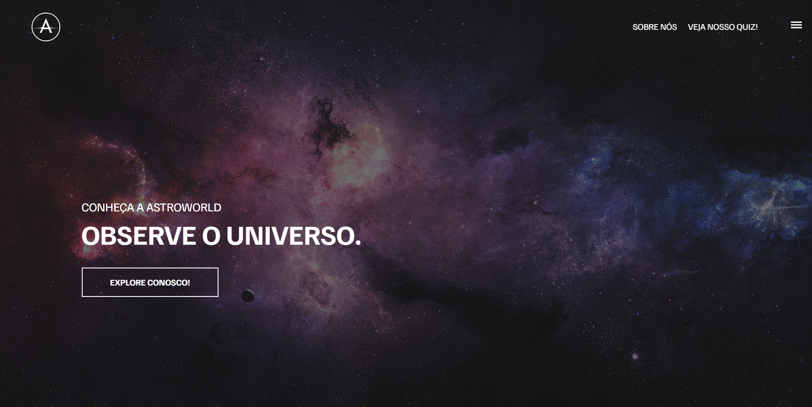

# ASTROWORLD  

 
 
 - TCC do Curso Técnico em Desenvolvimento de Sistemas da ETEC Sapopemba

 ## Objetivo
Nosso objetivo com este projeto é disseminar o conhecimento da Astronomia de forma democrática. Utilizando HTML, CSS e JS, o projeto 
inclui um site interativo e um jogo desenvolvido na plataforma GameMaker. A problemática abordada é a falta de recursos 
educacionais práticos na astronomia. 
As bases tecnológicas buscam superar essa 
barreira, oferecendo experiências envolventes. Redes sociais como Instagram, 
Facebook e TikTok são exploradas para amplificar o alcance, promovendo a 
interatividade e o engajamento. O AstroWorld emerge como uma plataforma 
inovadora, transcendendo a educação astronômica tradicional e inspirando uma nova 
geração de entusiastas.

## Equipe
> Davi Gabriel,
Daniel Reis,
Eduardo Dominguês,
Fellype Oliveira,
Gustavo Melo,
João Tarquini,
Wender Santos

## Funções
- **Daniel Reis**: Pesquisa e Desenvolvimento das partes do Site: **Sobre Nós** e **Sistema Solar**
-----
- **Davi Gabriel**: Pesquisa e Desenvolvimento do jogo feito na Plataforma **Gamemaker**
-----
- **Eduardo Dominguês**: Pesquisa e Desenvolvimento do **Artigo**.
---
- **Fellype Oliveira**: Pesquisa e Desenvolvimento da parte do Site: **Fenômenos** e criação de conteúdo no **Instagram** e **Tiktok**
---
- **Gustavo Melo**: Pesquisa e Desenvolvimento da parte do Site: **História da Astronomia**
------
- **João Tarquini**: Ajuda na Pesquisa e Desenvolvimento do **Artigo** e **Redes Sociais**
------
- **Wender Santos**: Pesquisa e Desenvolvimento das partes do Site: **Profissões e Gravidade**

## Acesso
[Clique aqui para acessar! :)](https://astroworld-tcc.vercel.app/)

## Tecnologias

- HTML
- CSS
- Git e Github
- JavaScript

## Contato
- Davi Gabriel:
[(Instagram)](https://www.instagram.com/gabrieldavi___/)
- Daniel Reis
[(Instagram)](https://www.instagram.com/_daaniel.xz/)
- Eduardo Dominguês
[(Instagram)](https://www.instagram.com/d.ominguesedu/)
- Fellype:
[(LinkedIn)](https://www.linkedin.com/in/fellype-oliveira-920699230/)
- Gustavo Melo
[(Instagram)](https://www.instagram.com/gustavofmelo_/)
- João Tarquini
[(Instagram)](https://www.instagram.com/j_tarquini08/)
- Wender Santos
[(Instagram)](https://www.instagram.com/wender1903/)
